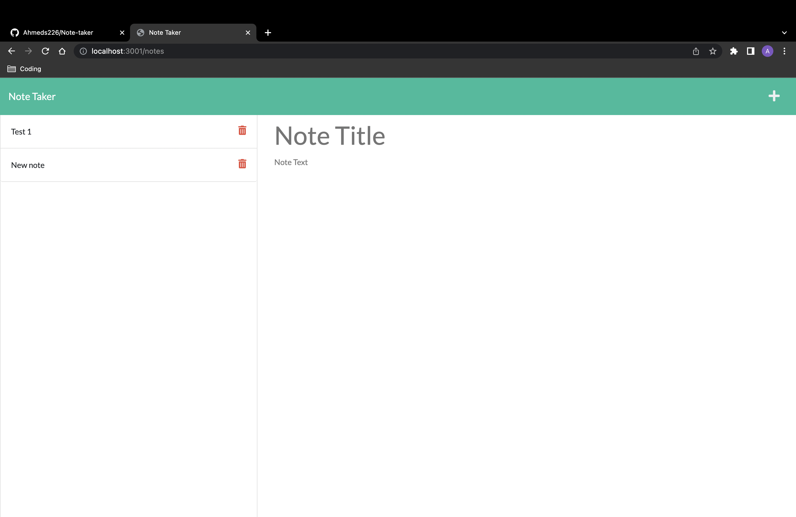

# Note-taker

I have created an application allowing users to create and store their notes, enabling them to keep track of the tasks they need to complete.

The applications features are as follows:

1. Enter new notes.
2. Saved notes on the left hand side of the page.
3. Ability to delete old notes for when the user either completes the task or does not need it anymore.

Deployed Link:

<!-- Github pages or Heroku? -->

## Preview:

